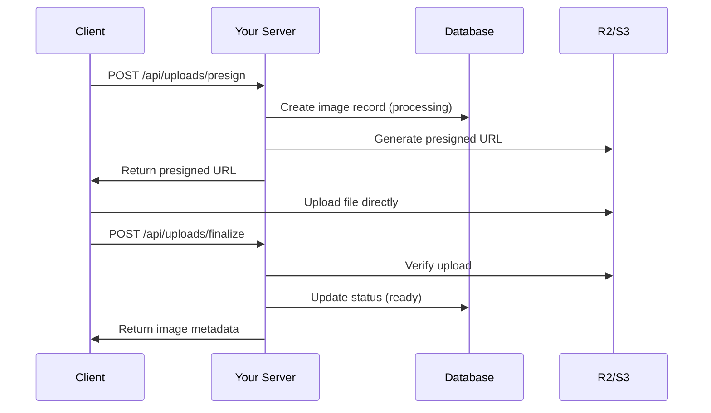

# Octoload

> **Minimal, composable image upload system with CLI for generating Drizzle schemas and typed clients**

Octoload provides **direct-to-storage uploads** using presigned URLs, eliminating server bottlenecks while maintaining full type safety and database integration.

[](https://badge.fury.io/js/octoload)
[](https://www.typescriptlang.org/)
[](https://codecov.io/gh/kahwee/octoload)
[](https://opensource.org/licenses/MIT)

---

## ✨ Features

- 🚀 **Direct-to-storage uploads** - Files bypass your server, uploaded directly to S3/R2
- 🛠️ **CLI-first approach** - Generate schemas, routes, and types automatically  
- 🔒 **Full TypeScript safety** - End-to-end type safety with zero `any` types
- 🏗️ **Framework adapters** - React Router v7, Next.js (more coming)
- 📊 **Drizzle integration** - Generated schemas work with any Drizzle-compatible database
- 🔄 **Multipart uploads** - Handle large files efficiently with progress tracking
- 🏷️ **Flexible metadata** - Tags, alt text, ownership, and custom fields

---

## 🚀 Quick Start

### Installation

```bash
pnpm add octoload drizzle-orm
```

### Initialize Project

```bash
pnpm dlx octoload init --adapter=s3 --framework=react-router
```

This generates:
- **Database schema** (`schema/octoload.ts`) 
- **Route handlers** (`app/routes/api/uploads.*`)
- **Configuration file** (`octoload.config.ts`)
- **Type definitions** (fully typed client and server interfaces)

### Basic Usage

```typescript
// Client-side upload
import { OctoloadClient } from 'octoload/client';

const client = new OctoloadClient({
  baseUrl: 'https://your-app.com'
});

const result = await client.uploadFile(file, {
  onProgress: ({ percentage }) => console.log(`${percentage}% uploaded`),
  onStateChange: (state) => console.log(`Upload ${state}`)
});

console.log('Image uploaded:', result.image.id);
```

### Server Configuration

```typescript
// octoload.config.ts
import { defineConfig } from 'octoload';

export default defineConfig({
  storage: {
    type: 's3',
    bucket: process.env.S3_BUCKET!,
    region: process.env.S3_REGION!,
    accessKeyId: process.env.AWS_ACCESS_KEY_ID!,
    secretAccessKey: process.env.AWS_SECRET_ACCESS_KEY!,
  },
  limits: {
    maxFileSize: 10 * 1024 * 1024, // 10MB
    allowedTypes: ['image/jpeg', 'image/png', 'image/webp'],
  }
});
```

---

## 📚 Documentation

### Core Concepts

- **[Design Rationale](./docs/RATIONALE.md)** - Why Octoload exists and architectural decisions
- **[API Reference](./docs/API.md)** - Complete API documentation  
- **[React Router Guide](./docs/react-router-guide.md)** - Framework-specific integration
- **[Type Safety](./docs/TYPES.md)** - TypeScript patterns and best practices

### Framework Guides

- **[React Router v7](./docs/react-router-guide.md)** - Complete setup and usage
- **[Next.js](./docs/nextjs-guide.md)** - App Router and Pages Router support
- **[Express](./docs/express-guide.md)** - Traditional Node.js integration *(coming soon)*
- **[Hono](./docs/hono-guide.md)** - Edge runtime support *(coming soon)*

### Advanced Topics

- **[Storage Adapters](./docs/STORAGE.md)** - S3, R2, and custom adapters
- **[Database Schema](./docs/SCHEMA.md)** - Understanding generated tables
- **[Authentication](./docs/AUTH.md)** - User ownership and permissions
- **[Hooks & Events](./docs/HOOKS.md)** - Custom processing and webhooks

---

## 🏗️ Architecture

### Direct-to-Storage Flow



### Database Schema

Generated schema includes:

```sql
-- Core image metadata
CREATE TABLE images (
  id UUID PRIMARY KEY,
  owner_id UUID,
  filename VARCHAR NOT NULL,
  content_type VARCHAR NOT NULL,
  byte_size INTEGER NOT NULL,
  status upload_status NOT NULL DEFAULT 'processing',
  storage_key VARCHAR NOT NULL,
  checksum VARCHAR,
  is_public BOOLEAN DEFAULT false,
  alt VARCHAR,
  title VARCHAR,
  created_at TIMESTAMP DEFAULT NOW(),
  updated_at TIMESTAMP DEFAULT NOW()
);

-- Multipart upload sessions
CREATE TABLE upload_sessions (
  id UUID PRIMARY KEY,
  image_id UUID REFERENCES images(id) ON DELETE CASCADE,
  upload_id VARCHAR, -- S3 multipart upload ID
  part_count INTEGER NOT NULL,
  expires_at TIMESTAMP NOT NULL
);

-- Optional: Asset variants (thumbnails, etc.)
CREATE TABLE asset_variants (
  id UUID PRIMARY KEY,
  image_id UUID REFERENCES images(id) ON DELETE CASCADE,
  variant_type VARCHAR NOT NULL, -- 'thumbnail', 'medium', 'large'
  storage_key VARCHAR NOT NULL,
  width INTEGER,
  height INTEGER,
  byte_size INTEGER NOT NULL
);

-- Optional: Flexible tagging
CREATE TABLE image_tags (
  id UUID PRIMARY KEY,
  image_id UUID REFERENCES images(id) ON DELETE CASCADE,
  tag VARCHAR NOT NULL,
  created_at TIMESTAMP DEFAULT NOW()
);
```

---

## 🔧 CLI Commands

```bash
# Initialize new project
pnpm dlx octoload init [options]
  --adapter <s3|r2>           Storage adapter (default: s3)
  --framework <react-router|nextjs>  Framework integration
  --database <postgres|mysql|sqlite>  Database type

# Generate/update database schema
pnpm dlx octoload generate

# Run database migrations
pnpm dlx octoload migrate

# Add new storage adapter
pnpm dlx octoload add adapter <name>

# Add framework integration  
pnpm dlx octoload add framework <name>
```

---

## 🎯 Use Cases

### Perfect For

✅ **Modern web applications** requiring scalable file uploads  
✅ **Teams using Drizzle ORM** and TypeScript  
✅ **Applications with strict type safety** requirements  
✅ **Projects needing cost-effective** file storage  
✅ **Multi-tenant applications** with user-owned content  

### Not Ideal For

❌ **Simple prototypes** (consider simpler solutions first)  
❌ **Legacy applications** without TypeScript  
❌ **Projects requiring image processing** (use with Sharp/ImageMagick)  
❌ **Applications needing built-in CDN** (use CloudFront separately)  

---

## 🔒 Security Features

- **Presigned URL expiration** (configurable, default 1 hour)
- **File type validation** (MIME type checking)
- **File size limits** (configurable per endpoint)
- **Checksum verification** (SHA-256 integrity checks)
- **User ownership** (files tied to authenticated users)
- **Access control** (public/private file permissions)

---

## 🌍 Ecosystem Integration

Octoload works seamlessly with popular tools:

```typescript
// 🔐 Authentication
import { auth } from './lib/better-auth';
import { createPresignHandler } from 'octoload';

export const action = createPresignHandler({
  config,
  db,
  schema,
  getUser: async (context) => {
    const session = await auth.api.getSession({ 
      headers: context.request.headers 
    });
    return session?.user || null;
  }
});

// 🖼️ Image Processing  
import sharp from 'sharp';

export default defineConfig({
  hooks: {
    afterFinalize: async (image) => {
      // Generate thumbnails
      const thumbnail = await sharp(imageBuffer)
        .resize(200, 200)
        .jpeg()
        .toBuffer();
      
      await uploadVariant(image.id, 'thumbnail', thumbnail);
    }
  }
});

// 📊 Analytics
import { track } from './lib/analytics';

export default defineConfig({
  hooks: {
    afterFinalize: async (image) => {
      track('image_uploaded', {
        userId: image.ownerId,
        fileSize: image.byteSize,
        contentType: image.contentType
      });
    }
  }
});
```

---

## 📈 Performance

### Scaling Characteristics

- **Concurrent uploads**: Handled by S3/R2 infrastructure
- **File size limits**: Up to 5TB (multipart uploads)
- **Server resources**: Constant regardless of file size
- **Database load**: Minimal (metadata operations only)

*Upload performance depends on client network, storage region, and file size.*

---

## 🤝 Contributing

We welcome contributions! See [CONTRIBUTING.md](./CONTRIBUTING.md) for guidelines.

### Development Setup

```bash
git clone https://github.com/kahwee/octoload.git
cd octoload
pnpm install
# or
pnpm install
```

### Running Tests

```bash
pnpm test           # Run test suite
pnpm run typecheck  # Type checking
pnpm run fix        # Format code
# or with pnpm
pnpm test
pnpm typecheck
pnpm fix
```

---

## 📝 License

MIT License - see [LICENSE](./LICENSE) for details.

---

## 🙏 Acknowledgments

Inspired by excellent CLI tools in the ecosystem:
- **[Drizzle Kit](https://github.com/drizzle-team/drizzle-kit-mirror)** - Database schema management
- **[Prisma](https://github.com/prisma/prisma)** - Type-safe database access  
- **[Better Auth](https://github.com/better-auth/better-auth)** - Modern authentication
- **[T3 Stack](https://github.com/t3-oss/create-t3-app)** - Full-stack TypeScript patterns

---

<div align="center">

**[Documentation](./docs) • [Examples](./examples) • [Community](https://github.com/kahwee/octoload/discussions)**

Made with ❤️ for the TypeScript community

</div>